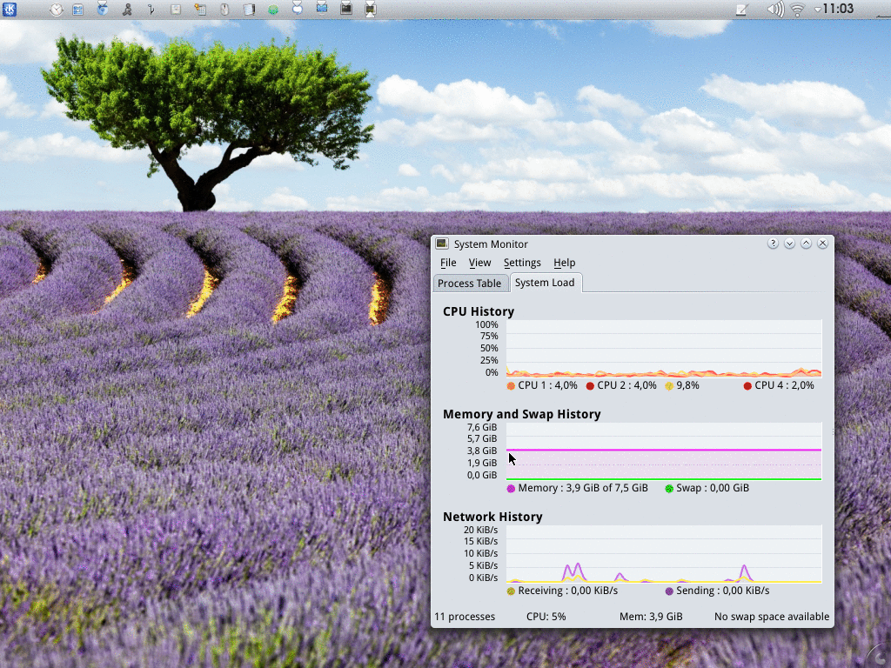

# kde4-profiles
This application allows you to define profiles for your KDE 4 desktop, similarly to profiles found on your phone. You define your profiles in ``profiles.yml`` with simple rules, each rule executes a command with the given arguments and gets executed in order. Rules can contain nested rules that get executed once the main rule executed successfully.



## Simple day/night example
```yaml
DAY:
  title: "Day"
  description: "Light colored profile."
  rules:
    - kde.notify: "Switching to daylight profile..."
    - plasma.theme: "default"
    - plasma.wallpaper: "$KDEWALLPAPER/Castilla_Sky/"
    - kde.widget_style: "oxygen"
    - kde.colorscheme: "$KDEDATA/color-schemes/Oxygen.colors"
    - kde.notify: "Done!"
NIGHT:
  title: "Night"
  description: "Dark colored profile."
  rules:
    - kde.notify: "Switching to night profile..."
    - plasma.theme: "oxygen"
    - plasma.wallpaper: "$KDEWALLPAPER/Prato/"
    - kde.widget_style: "cleanlooks"
    - kde.colorscheme: "$KDEDATA/color-schemes/WontonSoup.colors"
    - kde.notify: "Done!"
```

## Example with nested, dependent, rules.
```yaml
  rules:
    - kde.colorscheme: "$KDEDATA/color-schemes/Oxygen.colors"
    - yakuake.default_profile:
      - "day.profile"
      - yakuake.restart:
        - kde.notify: "Restarted yakuake"
    - plasma.restart:
```
